# 🔐 AWS S3 IAM Role-Based Access Control (RBAC) Project

[](https://aws.amazon.com)
[](https://aws.amazon.com/about-aws/global-infrastructure/regions_az/)
[](LICENSE)
[](docs/02-SECURITY-IMPROVEMENTS.md)

---

## 🌍 Real-World Scenario

Many organizations store critical business files — client reports, data exports, financial records — in Amazon S3. The challenge is **who gets access to what**, and ensuring no one can accidentally (or maliciously) delete production data.

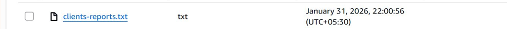
*Real corporate files stored in S3 — clients-reports.txt from January 31, 2026 in secure-corp-storage*

**This project solves that problem** by building a production-ready access control system using AWS IAM roles and the principle of least privilege.

---

## 📋 Project Overview

This system enforces **role-based access control** across three identities operating on the `secure-corp-storage` S3 bucket:

| 🧑‍💻 Identity | 📋 Role | 📂 List | ⬇️ Download | ⬆️ Upload | 🗑️ Delete |
|---|---|:---:|:---:|:---:|:---:|
| **Alice** (Developer) | `s3-read-write-get` | ✅ | ✅ | ✅ | ❌ |
| **Bob** (Viewer) | `s3-read-only` | ✅ | ✅ | ❌ | ❌ |
| **EC2 Instance** | `ec2-s3-access-role` | ✅ | ✅ | ✅ | ❌ |

**Key design decisions:**
- 🔒 **No one can delete** — not Alice, not Bob, not EC2
- 🎭 **IAM roles over long-term keys** — EC2 uses instance profile (temporary credentials)
- 🔑 **MFA enforcement** — Alice and Bob must use MFA to assume roles
- 🌐 **Network isolation** — EC2 in private subnet, ALB as public entry point

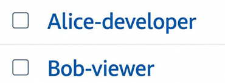
*Alice-developer and Bob-viewer — the two IAM users with controlled access*

---

## 🏗️ Architecture Diagram


> **AWS Account (US-EAST-1)** → **VPC: SECURE-S3-VPC** → **Public Subnet** → **ALB** → **EC2 (AWS CLI Host)** → **IAM Roles** → **S3: secure-corp-storage**

**Traffic flows:**
- Solid arrows → network traffic (HTTPS/443)
- Dotted arrows → IAM permission grants (sts:AssumeRole)

---

## 🚀 Quick Start

### Prerequisites
- AWS CLI configured (`aws configure`)
- Sufficient IAM permissions to create users, roles, and policies
- An existing VPC with public and private subnets

```bash
# 1. Make all scripts executable
chmod +x scripts/*.sh

# 2. Set up IAM users, roles, and policies
./scripts/setup-iam.sh

# 3. Create and configure S3 bucket
./scripts/setup-s3.sh

# 4. Launch EC2 instance and ALB
./scripts/setup-ec2.sh

# 5. Validate all permission scenarios
./scripts/test-permissions.sh
```

---

## 🛠️ Tech Stack

| Service | Purpose |
|---|---|
| **Amazon S3** | Secure object storage — `secure-corp-storage` bucket |
| **AWS IAM** | Identity & Access Management — 5 roles, 2 users, 6 policies |
| **Amazon EC2** | Application/CLI host with instance profile |
| **AWS ALB** | Application Load Balancer — internet-facing, multi-AZ |
| **AWS VPC** | Network isolation — `SECURE-S3-VPC` with private subnets |
| **AWS STS** | Temporary credential vending for role assumption |
| **AWS CLI** | Command-line S3 operations from EC2 |

---

## �� Repository Structure

```
s3-iam-rbac-project/
│
├── README.md                          # This file — overview & architecture
│
├── docs/
│   ├── 01-PROJECT-SETUP.md            # Complete setup guide with all screenshots
│   ├── 02-SECURITY-IMPROVEMENTS.md    # 8 production security improvements
│   └── 03-TESTING-VALIDATION.md       # Full test suite with evidence
│
├── iam-policies/
│   ├── ec2-s3-access-policy.json      # EC2 instance: list + get + put (no delete)
│   ├── s3-read-write-policy.json      # Alice: list + get + put (no delete)
│   ├── s3-read-only-policy.json       # Bob: list + get only
│   ├── trust-policy-ec2.json          # EC2 service trust relationship
│   ├── trust-policy-alice.json        # Alice role trust relationship (MFA required)
│   └── trust-policy-bob.json          # Bob role trust relationship (MFA required)
│
├── scripts/
│   ├── setup-iam.sh                   # Create users, roles, policies
│   ├── setup-s3.sh                    # Create and configure S3 bucket
│   ├── setup-ec2.sh                   # Launch EC2 + ALB
│   ├── test-permissions.sh            # Validate all allow/deny scenarios
│   └── cleanup.sh                     # Tear down all resources
│
└── images/                            # Real AWS console screenshots (20 images)
    ├── 01-architecture.png            # Architecture diagram
    ├── 02-downloads-folder.png        # Downloads folder — Data-report.csv
    ├── 03-s3-general-buckets.png      # S3 buckets list — secure-corp-storage
    ├── 04-s3-bucket-contents.png      # S3 contents — Access Denied on report3.txt
    ├── 05-ec2-download.png            # EC2 downloading report1.txt from S3
    ├── 06-ec2-upload.png              # EC2 uploading report5.txt to S3
    ├── 07-ec2-delete-denied.png       # EC2 AccessDenied on delete attempt
    ├── 08-s3-console.png              # EC2 CLI: aws s3 ls output
    ├── 09-iam-trust-read-only.png     # Trust policy for s3-read-only role
    ├── 10-iam-trust-write-get.png     # Trust policy for s3-read-write-get role
    ├── 11-alb-details.png             # ALB — Active, VPC, AZs (us-east-1a/1d)
    ├── 12-ec2-uploads-list.png        # Real S3 file: clients-reports.txt
    ├── 13-iam-users.png               # IAM Users — Alice-developer, Bob-viewer
    ├── 14-iam-roles.png               # IAM Roles — all 5 roles listed
    ├── 15-s3-read-write-policy.png    # Alice's policy JSON (List+Get+Put)
    ├── 16-s3-read-only-policy.png     # Bob's policy JSON (List+Get only)
    ├── 17-s3-bucket-details.png       # S3 bucket details — secure-corp-storage
    ├── 18-s3-bucket-contents-files.png # All files: Data-report.csv, reports 1-5
    ├── 19-s3-lifecycle-policy.png     # Lifecycle transitions timeline
    └── 20-architecture-diagram.png   # Architecture diagram (full system)
```

---

## 📸 Real AWS Console Screenshots

### S3 Bucket — Created and Configured

| S3 Buckets List | S3 Bucket Details |
|---|---|
|  |  |

| S3 Bucket Contents (All Files) | S3 Access Denied Demo |
|---|---|
| 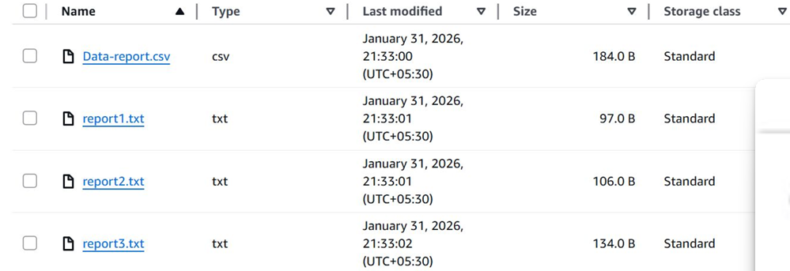 | 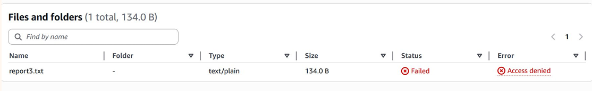 |

### IAM Configuration — Users and Roles

| IAM Users | IAM Roles |
|---|---|
|  | 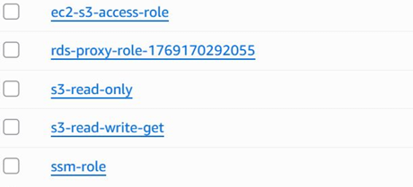 |

### IAM Policies — Permission Boundaries

| Alice's Policy (Read + Write) | Bob's Policy (Read Only) |
|---|---|
| 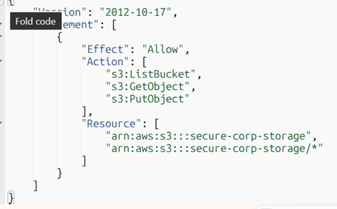 | 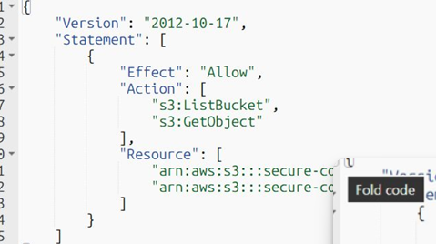 |

### IAM Trust Policies — Role Assumption with MFA

| Trust Policy (s3-read-only) | Trust Policy (s3-read-write-get) |
|---|---|
| 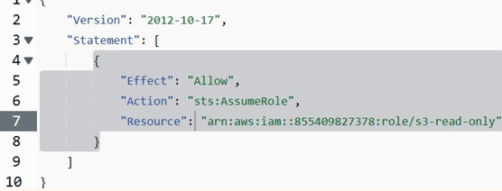 | 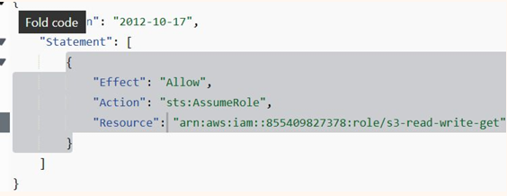 |

### EC2 Operations — Permission Enforcement in Action

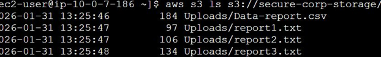
*EC2 CLI: `aws s3 ls s3://secure-corp-storage/` — listing all files with sizes and timestamps*

| Download ✅ | Upload ✅ | Delete ❌ |
|---|---|---|
| 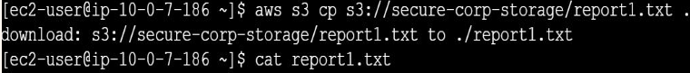 | 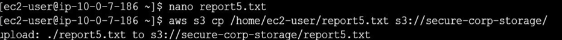 | 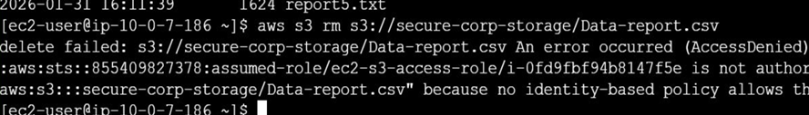 |

### Employee Downloads from S3

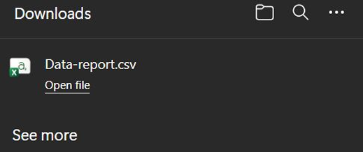
*Local Downloads folder showing Data-report.csv — a file downloaded from S3 by an employee*

### Application Load Balancer

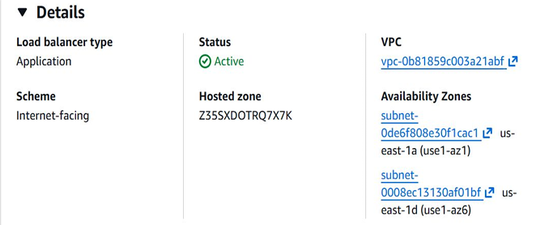
*ALB: Active status, SECURE-S3-VPC, multi-AZ (us-east-1a + us-east-1d)*

### S3 Lifecycle Policy

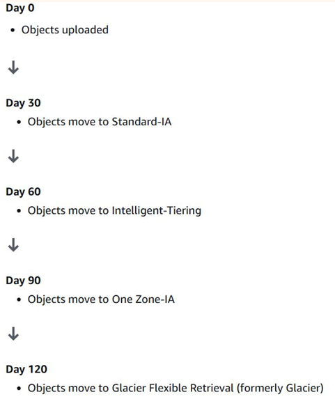
*Automated lifecycle: Standard → IA (30d) → Intelligent-Tiering (60d) → One Zone-IA (90d) → Glacier (120d)*

### Full Architecture Reference


*Complete system architecture: VPC → ALB → EC2 → IAM Roles → S3*

---

## 📚 Documentation

| Document | Description |
|---|---|
| [01-PROJECT-SETUP.md](docs/01-PROJECT-SETUP.md) | Complete walkthrough: S3, IAM, EC2, ALB setup with all 20 screenshots |
| [02-SECURITY-IMPROVEMENTS.md](docs/02-SECURITY-IMPROVEMENTS.md) | 8 production security hardening recommendations |
| [03-TESTING-VALIDATION.md](docs/03-TESTING-VALIDATION.md) | Full validation suite: EC2, Alice, Bob permission tests |

---

## 🔒 Security Highlights

- ✅ **Principle of Least Privilege** — no identity has more access than needed
- ✅ **No Delete permissions** for any user or EC2 role (not even developers)
- ✅ **S3 Public Access fully blocked** — no accidental public exposure
- ✅ **Bucket-level encryption** (SSE-S3 / AES-256)
- ✅ **IAM roles over long-term access keys** — EC2 uses instance profile
- ✅ **MFA enforcement** — Alice and Bob must pass MFA to assume roles
- ✅ **S3 Versioning** enabled — accidental overwrites are recoverable
- ✅ **Lifecycle policy** — automated cost optimization and data retention
- ✅ **VPC isolation** — EC2 in private subnet, not directly internet-accessible
- ✅ **ALB as entry point** — controlled public-facing ingress

---

## 📜 License

This project is licensed under the MIT License — see [LICENSE](LICENSE) for details.

---

*Built with ❤️ using AWS best practices for production-grade S3 access control*
