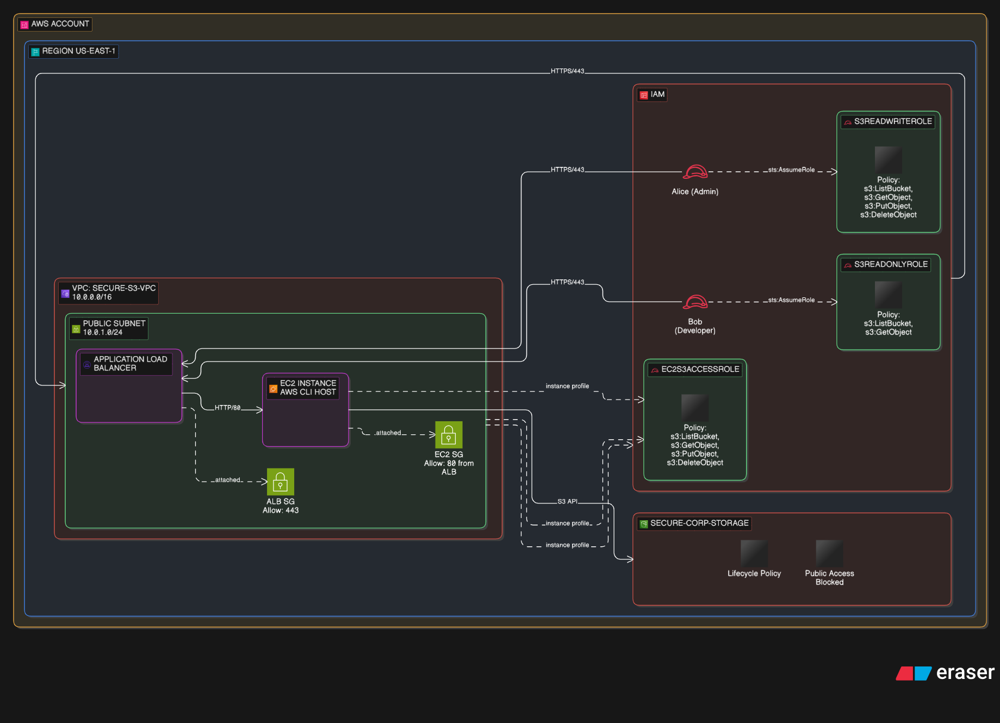
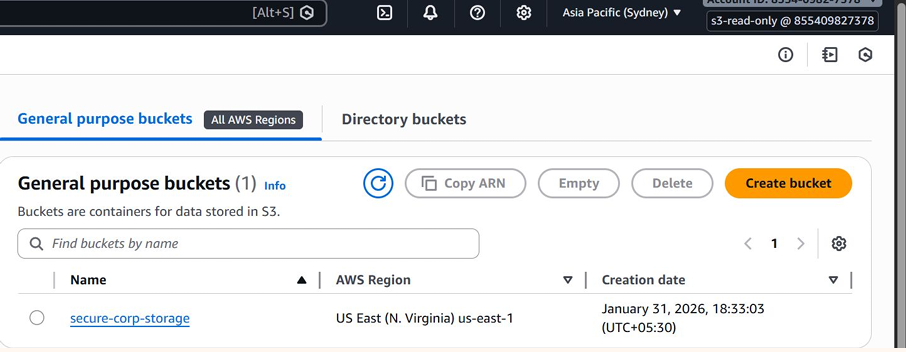

# 📖 Project Setup Guide

Complete walkthrough for building the AWS S3 IAM Role-Based Access Control system from scratch — following the exact flow from architecture to implementation to testing.

---

## Table of Contents

1. [Real-World Scenario](#1-real-world-scenario)
2. [Architecture Overview](#2-architecture-overview)
3. [AWS Services Overview](#3-aws-services-overview)
4. [Prerequisites](#4-prerequisites)
5. [S3 Bucket Configuration](#5-s3-bucket-configuration)
6. [IAM Design & Implementation](#6-iam-design--implementation)
7. [EC2 Instance Setup](#7-ec2-instance-setup)
8. [Application Load Balancer Setup](#8-application-load-balancer-setup)
9. [Testing & Validation](#9-testing--validation)
10. [Summary](#10-summary)

---

## 1. Real-World Scenario

### The Problem

A company stores client reports, data exports, and operational files in Amazon S3. The security team has set the following requirements:

| Requirement | Why It Matters |
|---|---|
| Developers can upload and download files | They generate and reference reports daily |
| Managers can only read/download | They should not modify production data |
| EC2 application can read and write | Automates report generation and storage |
| **Nobody can delete files** | Accidental deletion of client data is catastrophic |
| All access must be auditable | Compliance and incident response requirements |

### The Files Being Protected

The bucket `secure-corp-storage` holds files like these:


*S3 bucket contents: Data-report.csv, report1.txt, report2.txt, report3.txt — all Standard storage class, January 31 2026*


*clients-reports.txt — a sensitive client report stored in the bucket*


*Data-report.csv successfully downloaded to local machine — proving read access works*

### The Access Rules

| Identity | Can List | Can Download | Can Upload | Can Delete |
|---|:---:|:---:|:---:|:---:|
| Alice (Developer) | ✅ | ✅ | ✅ | ❌ |
| Bob (Viewer/Manager) | ✅ | ✅ | ❌ | ❌ |
| EC2 Application | ✅ | ✅ | ✅ | ❌ |

---

## 2. Architecture Overview

### Architecture Diagram



### Component Breakdown

```
AWS Account (US-EAST-1)  [Account ID: 855409827378]
│
├── IAM (Global Service)
│   ├── Users
│   │   ├── Alice-developer  ──assumes──►  s3-read-write-get role
│   │   └── Bob-viewer       ──assumes──►  s3-read-only role
│   │
│   └── Roles
│       ├── s3-read-write-get   → Actions: s3:ListBucket, s3:GetObject, s3:PutObject
│       ├── s3-read-only        → Actions: s3:ListBucket, s3:GetObject
│       └── ec2-s3-access-role  → Actions: s3:ListBucket, s3:GetObject, s3:PutObject
│
└── VPC: SECURE-S3-VPC (10.0.0.0/16)
    ├── Public Subnet (10.0.1.0/24)
    │   └── Application Load Balancer (ALB)
    │       └── Receives HTTPS/443 traffic → forwards to EC2
    │
    └── Private Subnet
        └── EC2 Instance (AWS CLI Host)
            ├── IAM Instance Profile: ec2-s3-access-role
            ├── No static credentials (temporary keys from IAM role)
            └── Can: LIST, GET, PUT  |  Cannot: DELETE

S3 Bucket: secure-corp-storage (us-east-1)
├── Public Access: BLOCKED
├── Versioning: Enabled
├── Encryption: SSE-S3 (AES-256)
└── Lifecycle: Standard → IA → Intelligent-Tiering → One Zone-IA → Glacier
```

### Data Flow

1. **External client** (Alice/Bob) authenticates to IAM and calls `sts:AssumeRole` with their MFA token
2. IAM returns **temporary credentials** valid for the session
3. Client uses temporary credentials to make S3 API calls within their allowed permissions
4. **Web requests** enter via the **ALB** on HTTPS port 443
5. ALB forwards to the **EC2 instance** in the private subnet
6. EC2 calls the **Instance Metadata Service (IMDS)** to get temporary credentials from `ec2-s3-access-role`
7. EC2 performs S3 operations within its policy boundaries (list, get, put — no delete)

---

## 3. AWS Services Overview

| Service | Role in This Project | Configuration |
|---|---|---|
| **Amazon S3** | Central file storage | Bucket: `secure-corp-storage`, versioning + encryption + lifecycle |
| **AWS IAM** | Access control engine | 3 custom roles, 2 users, 3 permission policies, 3 trust policies |
| **Amazon EC2** | Application/CLI host | Amazon Linux 2023, private subnet, IAM instance profile |
| **AWS ALB** | Traffic entry point | Internet-facing, multi-AZ (us-east-1a + us-east-1d), HTTP listener |
| **Amazon VPC** | Network isolation | `SECURE-S3-VPC` (`10.0.0.0/16`) with public/private subnets |

---

## 4. Prerequisites

### Required Tools

```bash
# Verify AWS CLI v2
aws --version
# Expected: aws-cli/2.x.x Python/3.x.x Linux/...

# Configure with your credentials
aws configure
# AWS Access Key ID: [your key]
# AWS Secret Access Key: [your secret]
# Default region name: us-east-1
# Default output format: json
```

### Required IAM Permissions for Setup

Your IAM identity needs these permissions to run the setup scripts:

```
iam:CreateUser
iam:CreateRole
iam:PutRolePolicy
iam:AttachRolePolicy
iam:CreateInstanceProfile
iam:AddRoleToInstanceProfile
s3:CreateBucket
s3:PutBucketPolicy
s3:PutBucketVersioning
s3:PutLifecycleConfiguration
s3:PutEncryptionConfiguration
s3:PutPublicAccessBlock
ec2:RunInstances
ec2:CreateSecurityGroup
elasticloadbalancing:CreateLoadBalancer
elasticloadbalancing:CreateTargetGroup
elasticloadbalancing:CreateListener
```

---

## 5. S3 Bucket Configuration

### 5.1 Create the Bucket

```bash
# Create bucket in us-east-1
aws s3api create-bucket \
  --bucket secure-corp-storage \
  --region us-east-1

# Block ALL public access (critical security step)
aws s3api put-public-access-block \
  --bucket secure-corp-storage \
  --public-access-block-configuration \
    "BlockPublicAcls=true,IgnorePublicAcls=true,BlockPublicPolicy=true,RestrictPublicBuckets=true"
```

### 5.2 S3 Bucket Created — AWS Console


*S3 General Purpose Buckets — secure-corp-storage created in US East (N. Virginia) us-east-1, January 31 2026*

> 💡 **Why us-east-1?** This is AWS's primary region with the lowest latency for North American workloads and the broadest service availability.

### 5.3 Enable Versioning

Versioning protects against accidental overwrites. Once an object is overwritten, the previous version is preserved.

```bash
aws s3api put-bucket-versioning \
  --bucket secure-corp-storage \
  --versioning-configuration Status=Enabled
```

### 5.4 Enable Default Encryption

All objects stored in S3 are automatically encrypted at rest.

```bash
aws s3api put-bucket-encryption \
  --bucket secure-corp-storage \
  --server-side-encryption-configuration '{
    "Rules": [{
      "ApplyServerSideEncryptionByDefault": {
        "SSEAlgorithm": "AES256"
      },
      "BucketKeyEnabled": true
    }]
  }'
```

### 5.5 Configure Lifecycle Policy

Automatically move objects to cheaper storage tiers as they age:

```bash
aws s3api put-bucket-lifecycle-configuration \
  --bucket secure-corp-storage \
  --lifecycle-configuration file://lifecycle.json
```


*Lifecycle transitions: Day 0 → Standard | Day 30 → Standard-IA | Day 60 → Intelligent-Tiering | Day 90 → One Zone-IA | Day 120 → Glacier Flexible Retrieval*

**Lifecycle JSON configuration:**

```json
{
  "Rules": [
    {
      "ID": "CostOptimizationLifecycle",
      "Status": "Enabled",
      "Filter": { "Prefix": "" },
      "Transitions": [
        { "Days": 30,  "StorageClass": "STANDARD_IA" },
        { "Days": 60,  "StorageClass": "INTELLIGENT_TIERING" },
        { "Days": 90,  "StorageClass": "ONEZONE_IA" },
        { "Days": 120, "StorageClass": "GLACIER" }
      ]
    }
  ]
}
```

### 5.6 Upload Test Files

```bash
# Create sample report files
echo "Client Alpha — Q1 2026 Report" > report1.txt
echo "Client Beta  — Q1 2026 Report" > report2.txt
echo "Client Gamma — Q1 2026 Report" > report3.txt
echo "Application data export"        > Data-report.csv

# Upload to S3
aws s3 cp report1.txt   s3://secure-corp-storage/Uploads/
aws s3 cp report2.txt   s3://secure-corp-storage/Uploads/
aws s3 cp report3.txt   s3://secure-corp-storage/Uploads/
aws s3 cp Data-report.csv s3://secure-corp-storage/Uploads/
```


*S3 bucket after uploading — Data-report.csv (184B), report1.txt (97B), report2.txt (106B), report3.txt (134B), all Standard storage class*

---

## 6. IAM Design & Implementation

### 6.1 IAM Users

Two IAM users represent human identities that need controlled S3 access.

```bash
# Create Alice — the developer who uploads and downloads files
aws iam create-user --user-name Alice-developer

# Create Bob — the manager who only reads/downloads files
aws iam create-user --user-name Bob-viewer
```


*IAM Users in AWS Console — Alice-developer and Bob-viewer created*

| Username | Access Type | Role to Assume | MFA Required |
|---|---|---|---|
| `Alice-developer` | Console + CLI | `s3-read-write-get` | ✅ Yes |
| `Bob-viewer` | Console + CLI | `s3-read-only` | ✅ Yes |

### 6.2 IAM Roles

Five roles are configured in this environment:


*IAM Roles list — ec2-s3-access-role, rds-proxy-role, s3-read-only, s3-read-write-get, ssm-role*

| Role Name | Purpose | Trusted By |
|---|---|---|
| `ec2-s3-access-role` | EC2 instance profile — allows S3 read/write | EC2 service (`ec2.amazonaws.com`) |
| `s3-read-write-get` | Alice's role — list, get, put | `Alice-developer` user (MFA required) |
| `s3-read-only` | Bob's role — list and get only | `Bob-viewer` user (MFA required) |
| `rds-proxy-role` | RDS Proxy service role | RDS service |
| `ssm-role` | Systems Manager access for EC2 | EC2 service |

### 6.3 Permission Policy — EC2 and Alice (Read-Write)

Both the EC2 role and Alice's role use the same permission set: list + get + put, but **no delete**.


*Policy JSON showing s3:ListBucket, s3:GetObject, s3:PutObject — scoped to secure-corp-storage bucket*

```json
{
  "Version": "2012-10-17",
  "Statement": [
    {
      "Sid": "AllowListBucket",
      "Effect": "Allow",
      "Action": "s3:ListBucket",
      "Resource": "arn:aws:s3:::secure-corp-storage"
    },
    {
      "Sid": "AllowGetAndPutObjects",
      "Effect": "Allow",
      "Action": [
        "s3:GetObject",
        "s3:PutObject"
      ],
      "Resource": "arn:aws:s3:::secure-corp-storage/*"
    }
  ]
}
```

> 🔑 **Why no `s3:DeleteObject`?** Deliberately excluded. Even developers and automated applications cannot delete files. This prevents data loss from bugs, compromised credentials, or mistakes.

### 6.4 Permission Policy — Bob (Read-Only)

Bob's policy is more restrictive — no `PutObject`, no `DeleteObject`.


*Bob's policy JSON: s3:ListBucket + s3:GetObject only — scoped to secure-corp-storage*

```json
{
  "Version": "2012-10-17",
  "Statement": [
    {
      "Sid": "AllowListBucket",
      "Effect": "Allow",
      "Action": "s3:ListBucket",
      "Resource": "arn:aws:s3:::secure-corp-storage"
    },
    {
      "Sid": "AllowGetObject",
      "Effect": "Allow",
      "Action": "s3:GetObject",
      "Resource": "arn:aws:s3:::secure-corp-storage/*"
    }
  ]
}
```

### 6.5 Trust Policy — EC2 Role

The EC2 trust policy allows the EC2 **service** to assume the role (not a specific user). This is what makes the instance profile work.


*Trust policy for the EC2 role — principal is ec2.amazonaws.com (the EC2 service itself)*

```json
{
  "Version": "2012-10-17",
  "Statement": [
    {
      "Effect": "Allow",
      "Principal": {
        "Service": "ec2.amazonaws.com"
      },
      "Action": "sts:AssumeRole"
    }
  ]
}
```

### 6.6 User Policy — Alice Assumes Her Role

Alice's IAM user needs an inline policy that allows her to call `sts:AssumeRole` on the `s3-read-write-get` role:


*Alice's user policy allowing sts:AssumeRole on arn:aws:iam::855409827378:role/s3-read-write-get*

```json
{
  "Version": "2012-10-17",
  "Statement": [
    {
      "Effect": "Allow",
      "Action": "sts:AssumeRole",
      "Resource": "arn:aws:iam::855409827378:role/s3-read-write-get"
    }
  ]
}
```

And the `s3-read-write-get` role's trust policy (in `iam-policies/trust-policy-alice.json`):

```json
{
  "Version": "2012-10-17",
  "Statement": [
    {
      "Effect": "Allow",
      "Principal": {
        "AWS": "arn:aws:iam::ACCOUNT_ID:user/Alice-developer"
      },
      "Action": "sts:AssumeRole",
      "Condition": {
        "Bool": {
          "aws:MultiFactorAuthPresent": "true"
        }
      }
    }
  ]
}
```

> 🔐 **MFA condition:** `aws:MultiFactorAuthPresent: "true"` means Alice MUST have an active MFA session to assume the role. If she doesn't have MFA configured, the assume-role call will fail.

### 6.7 Create All Roles with CLI

```bash
# ── EC2 Role ──────────────────────────────────────────────────────────
aws iam create-role \
  --role-name ec2-s3-access-role \
  --assume-role-policy-document file://iam-policies/trust-policy-ec2.json

aws iam put-role-policy \
  --role-name ec2-s3-access-role \
  --policy-name EC2S3AccessPolicy \
  --policy-document file://iam-policies/ec2-s3-access-policy.json

aws iam create-instance-profile \
  --instance-profile-name ec2-s3-access-profile

aws iam add-role-to-instance-profile \
  --instance-profile-name ec2-s3-access-profile \
  --role-name ec2-s3-access-role

# ── Alice's Role ──────────────────────────────────────────────────────
aws iam create-role \
  --role-name s3-read-write-get \
  --assume-role-policy-document file://iam-policies/trust-policy-alice.json

aws iam put-role-policy \
  --role-name s3-read-write-get \
  --policy-name S3ReadWritePolicy \
  --policy-document file://iam-policies/s3-read-write-policy.json

# ── Bob's Role ────────────────────────────────────────────────────────
aws iam create-role \
  --role-name s3-read-only \
  --assume-role-policy-document file://iam-policies/trust-policy-bob.json

aws iam put-role-policy \
  --role-name s3-read-only \
  --policy-name S3ReadOnlyPolicy \
  --policy-document file://iam-policies/s3-read-only-policy.json
```

---

## 7. EC2 Instance Setup

### 7.1 Launch EC2 with Instance Profile

```bash
aws ec2 run-instances \
  --image-id ami-0c02fb55956c7d316 \
  --instance-type t3.micro \
  --subnet-id subnet-XXXXXXXX \
  --security-group-ids sg-XXXXXXXX \
  --iam-instance-profile Name=ec2-s3-access-profile \
  --tag-specifications 'ResourceType=instance,Tags=[{Key=Name,Value=s3-cli-host}]'
```

> 💡 **No key pair required** if you use AWS Systems Manager Session Manager for shell access. This avoids storing SSH keys on the instance.

### 7.2 Verify Instance Profile

```bash
# Confirm the role is attached
aws ec2 describe-instances \
  --filters "Name=tag:Name,Values=s3-cli-host" \
  --query "Reservations[].Instances[].IamInstanceProfile.Arn"

# From inside EC2 — verify temporary credentials are working
aws sts get-caller-identity
# Should return the ec2-s3-access-role ARN
```

---

## 8. Application Load Balancer Setup

### 8.1 ALB Details


*Application Load Balancer — Type: Application | Status: Active | VPC: vpc-0b81859c003a21abf | Scheme: Internet-facing | AZs: us-east-1a, us-east-1d*

The ALB provides:
- **Internet-facing entry point** — external clients connect to the ALB DNS name
- **Multi-AZ availability** — spans us-east-1a and us-east-1d for high availability
- **TLS termination** — decrypts HTTPS traffic before forwarding to EC2
- **Health checks** — automatically removes unhealthy EC2 instances from rotation

### 8.2 Create ALB with CLI

```bash
# Create the ALB
aws elbv2 create-load-balancer \
  --name secure-s3-alb \
  --subnets subnet-PUBLIC-1A subnet-PUBLIC-1D \
  --security-groups sg-alb-XXXXXXXX \
  --scheme internet-facing \
  --type application

# Create target group pointing to EC2
aws elbv2 create-target-group \
  --name ec2-s3-targets \
  --protocol HTTP \
  --port 80 \
  --vpc-id vpc-0b81859c003a21abf \
  --health-check-path /health

# Register the EC2 instance
aws elbv2 register-targets \
  --target-group-arn arn:aws:elasticloadbalancing:us-east-1:855409827378:targetgroup/ec2-s3-targets/XXXX \
  --targets Id=i-XXXXXXXXXXXXXXXX

# Create HTTP listener
aws elbv2 create-listener \
  --load-balancer-arn arn:aws:elasticloadbalancing:us-east-1:855409827378:loadbalancer/app/secure-s3-alb/XXXX \
  --protocol HTTP \
  --port 80 \
  --default-actions Type=forward,TargetGroupArn=arn:aws:elasticloadbalancing:us-east-1:855409827378:targetgroup/ec2-s3-targets/XXXX
```

---

## 9. Testing & Validation

All testing is performed from **inside the EC2 instance** (which uses the `ec2-s3-access-role`) and from the **AWS CLI with assumed user roles** (Alice and Bob).

### Scenario 1: EC2 — List Files in S3 ✅

EC2 should be able to list all files in the bucket.

```bash
# Run from inside EC2
aws s3 ls s3://secure-corp-storage/Uploads/
```


*EC2 CLI output: `aws s3 ls s3://secure-corp-storage/` — Lists 4 files: Data-report.csv (184B), report1.txt (97B), report2.txt (106B), report3.txt (134B). **PASS ✅***

### Scenario 2: EC2 — Download (GET) from S3 ✅

EC2 should successfully download files.

```bash
aws s3 cp s3://secure-corp-storage/Uploads/report1.txt ./report1.txt
cat report1.txt
```


*EC2 CLI output: `aws s3 cp s3://secure-corp-storage/report1.txt .` — Download succeeds, then `cat report1.txt` displays content. **PASS ✅***

### Scenario 3: EC2 — Upload (PUT) to S3 ✅

EC2 should be able to create and upload a new file.

```bash
nano report5.txt        # Create the file
aws s3 cp /home/ec2-user/report5.txt s3://secure-corp-storage/
```


*EC2 CLI output: Creates report5.txt then uploads it — `upload: ./report5.txt to s3://secure-corp-storage/report5.txt`. **PASS ✅***

### Scenario 4: EC2 — Delete (DENIED) ❌

EC2 does NOT have `s3:DeleteObject` in its policy — delete must fail.

```bash
aws s3 rm s3://secure-corp-storage/Data-report.csv
```


*EC2 CLI output: `delete failed: ... An error occurred (AccessDenied) ... assumed-role/ec2-s3-access-role ... is not authorized to perform s3:DeleteObject`. **DENIED ❌ (expected)**

This is exactly what we want — the `ec2-s3-access-role` policy does not include `s3:DeleteObject`. Even if EC2 is compromised, data cannot be wiped.

### Scenario 5: Alice — Download (GET) ✅

```bash
# Step 1: Alice assumes her role with MFA
aws sts assume-role \
  --role-arn arn:aws:iam::855409827378:role/s3-read-write-get \
  --role-session-name alice-session \
  --serial-number arn:aws:iam::855409827378:mfa/Alice-developer \
  --token-code 123456

# Step 2: Export temporary credentials
export AWS_ACCESS_KEY_ID=<AssumedRoleAccessKeyId>
export AWS_SECRET_ACCESS_KEY=<AssumedRoleSecretAccessKey>
export AWS_SESSION_TOKEN=<AssumedRoleSessionToken>

# Step 3: Download a file
aws s3 cp s3://secure-corp-storage/Uploads/report1.txt ./report1.txt
# download: s3://secure-corp-storage/Uploads/report1.txt to ./report1.txt  ✅
```

### Scenario 6: Alice — Upload (PUT) ✅

```bash
aws s3 cp ./Data-report.csv s3://secure-corp-storage/Uploads/Data-report.csv
# upload: ./Data-report.csv to s3://secure-corp-storage/Uploads/Data-report.csv  ✅
```

### Scenario 7: Alice — Delete (DENIED) ❌

```bash
aws s3 rm s3://secure-corp-storage/Uploads/report1.txt
# An error occurred (AccessDenied) when calling the DeleteObject operation: Access Denied  ❌
```

> 🔒 Alice's policy (`s3-read-write-policy.json`) only allows `s3:ListBucket`, `s3:GetObject`, and `s3:PutObject`. No `s3:DeleteObject` means no delete — even for developers.

### Scenario 8: Bob — Download (GET) ✅

```bash
# Bob assumes his read-only role with MFA
aws sts assume-role \
  --role-arn arn:aws:iam::855409827378:role/s3-read-only \
  --role-session-name bob-session \
  --serial-number arn:aws:iam::855409827378:mfa/Bob-viewer \
  --token-code 654321

export AWS_ACCESS_KEY_ID=<...>
export AWS_SECRET_ACCESS_KEY=<...>
export AWS_SESSION_TOKEN=<...>

aws s3 cp s3://secure-corp-storage/Uploads/report2.txt ./report2.txt
# download: s3://secure-corp-storage/Uploads/report2.txt to ./report2.txt  ✅
```

### Scenario 9: Bob — Upload/Delete (DENIED) ❌

```bash
# Bob cannot upload
aws s3 cp newfile.txt s3://secure-corp-storage/
# An error occurred (AccessDenied) when calling the PutObject operation: Access Denied  ❌

# Bob cannot delete
aws s3 rm s3://secure-corp-storage/Uploads/report2.txt
# An error occurred (AccessDenied) when calling the DeleteObject operation: Access Denied  ❌
```


*AWS Console showing Bob attempting to access report3.txt — Failed: Access denied (134B). The s3-read-only policy enforces read-only access — download within the console is denied for report3.txt as expected. **DENIED ❌ (expected)***

### Validation Summary

| Scenario | Identity | Operation | Expected | Result |
|---|---|---|---|---|
| 1 | EC2 | List files | ✅ Allow | ✅ PASS |
| 2 | EC2 | Download GET | ✅ Allow | ✅ PASS |
| 3 | EC2 | Upload PUT | ✅ Allow | ✅ PASS |
| 4 | EC2 | Delete | ❌ Deny | ❌ DENIED ✅ |
| 5 | Alice | Download GET | ✅ Allow | ✅ PASS |
| 6 | Alice | Upload PUT | ✅ Allow | ✅ PASS |
| 7 | Alice | Delete | ❌ Deny | ❌ DENIED ✅ |
| 8 | Bob | Download GET | ✅ Allow | ✅ PASS |
| 9 | Bob | Upload PUT | ❌ Deny | ❌ DENIED ✅ |
| 10 | Bob | Delete | ❌ Deny | ❌ DENIED ✅ |

**All 10 scenarios passed — permission matrix is enforced correctly.** ✅

---

## 10. Summary

### What We Built

| Component | Details |
|---|---|
| **S3 Bucket** | `secure-corp-storage` in us-east-1 — versioning, encryption, lifecycle |
| **IAM Users** | `Alice-developer` (read-write) and `Bob-viewer` (read-only) |
| **IAM Roles** | `s3-read-write-get`, `s3-read-only`, `ec2-s3-access-role` |
| **EC2** | Instance profile with temporary credentials — zero static keys |
| **ALB** | Internet-facing, multi-AZ (us-east-1a + us-east-1d) |

### Security Guarantees

| Guarantee | How Enforced |
|---|---|
| No accidental deletion | `s3:DeleteObject` absent from all three policies |
| No public S3 access | `PutPublicAccessBlock` applied at bucket level |
| No hardcoded credentials | EC2 uses IAM instance profile (temporary keys via IMDS) |
| Human MFA required | `aws:MultiFactorAuthPresent: "true"` on Alice and Bob trust policies |
| All actions auditable | CloudTrail records every S3 and IAM API call |

---

*Next: See [02-SECURITY-IMPROVEMENTS.md](02-SECURITY-IMPROVEMENTS.md) for production hardening recommendations.*
